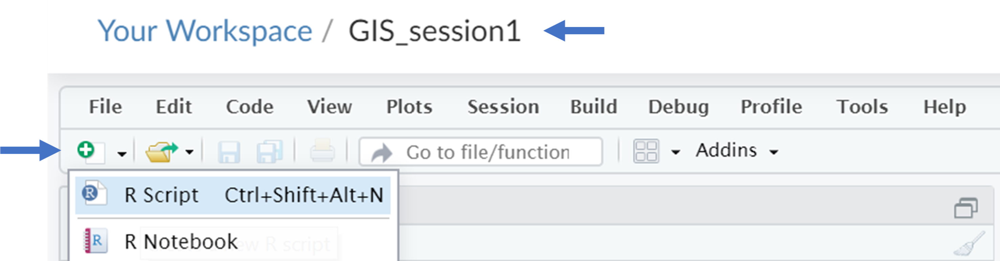

# GIS in R: Session 1

#### Step 1
Go to the Chicago data portal at [https://data.cityofchicago.org/](https://data.cityofchicago.org/). Search for ```community areas``` and click on ```Boundaries - Community Areas (current)```. Then export the geospatial data file as a ```shapefile```.


#### Step 2
Sign-up for a free RStudio Cloud account at [https://rstudio.cloud/](https://rstudio.cloud/)


#### Step 3
In Rstudio Cloud create a ```New Project```. Click on the project title to rename it as ```GIS_Session_1``` and start a new ```R Script``` by clicking the ```Plus``` arrow on the top left of the screen. At this point let's save our new script. Click ```File - Save As```. Save it as ```my_first_script.R```. As a note, an ```.R``` file is a R script file.




#### Step 4
R is an open source coding software with a lot of pre-built librarys of code. We can freely use these librarys but we have to install them. We will be using three librayrs today. Type the code below in your R-script to load these librarys. 
```
install.packages("sf")
install.packages("raster")
install.packages("ggplot2")

library(sf)
library(raster)
library(gglplot2)
```


....image of final project = CCA
You can use the [editor on GitHub](https://github.com/christopher-l-ahmed/R-GIS/edit/master/README.md) to maintain and preview the content for your website in Markdown files.

Whenever you commit to this repository, GitHub Pages will run [Jekyll](https://jekyllrb.com/) to rebuild the pages in your site, from the content in your Markdown files.

### Markdown

Markdown is a lightweight and easy-to-use syntax for styling your writing. It includes conventions for

```markdown
Syntax highlighted code block

# Header 1
## Header 2
### Header 3

- Bulleted
- List

1. Numbered
2. List

**Bold** and _Italic_ and `Code` text

[Link](url) and 
```

For more details see [GitHub Flavored Markdown](https://guides.github.com/features/mastering-markdown/).

### Jekyll Themes

Your Pages site will use the layout and styles from the Jekyll theme you have selected in your [repository settings](https://github.com/christopher-l-ahmed/R-GIS/settings). The name of this theme is saved in the Jekyll `_config.yml` configuration file.

### Support or Contact

Having trouble with Pages? Check out our [documentation](https://help.github.com/categories/github-pages-basics/) or [contact support](https://github.com/contact) and we’ll help you sort it out.
