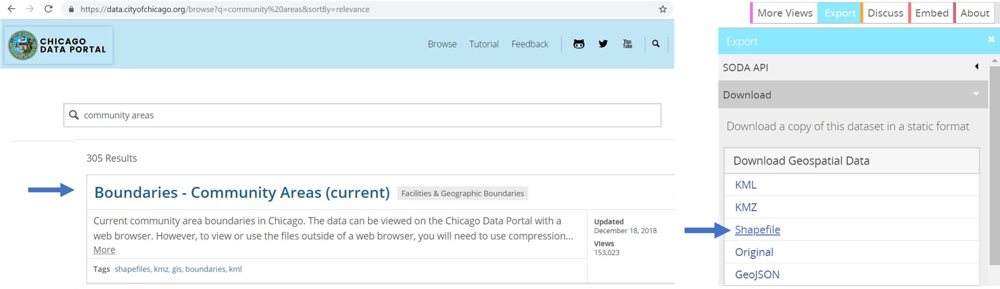

# Table of Contents

```Session 1```
[Map Chicago's Community Areas](#session-1-map-chicagos-community-areas)

```Session 2```
[Map life expectancy by Chicago Community Areas](#session-2-map-life-expectancy-by-chicago-community-areas)

```Session 3```
[Make a Shiny App Part 1](#session-3-make-a-shiny-app-part-1)

```Session 4```
[Make a Shiny App Part 2](#session-4-make-a-shiny-app-part-2)

# Session 1 (map Chicago's Community Areas)

#### Step 1
Go to the Chicago data portal at [https://data.cityofchicago.org/](https://data.cityofchicago.org/). Search for ```community areas``` and click on ```Boundaries - Community Areas (current)```. Then export the geospatial data file as a ```shapefile```.
**Note**: we want to keep this downloaded file zipped, some mac computers may automaticall unzip this file, if this happens to you open the folder you just downloaded (it will contain serveral files which together act as one shapefile), highlight all of these files and click to compress/zip them.



#### Step 2
Sign-up for a free RStudio Cloud account at [https://rstudio.cloud/](https://rstudio.cloud/)


#### Step 3
In Rstudio Cloud create a ```New Project```. Click on the project title to rename it as ```GIS_Session_1``` and start a new ```R Script``` by clicking the ```Plus``` arrow on the top left of the screen. At this point let's save our new script. Click ```File - Save As```. Save it as ```my_first_script.R```. As a note, an ```.R``` file is a R script file.


#### Step 4
R is an open source coding software with a lot of pre-built libraries of code. We can freely use these libraries but we have to install and load them first. Type the code below in your R-script, the first three lines are used to install the libraries, the next four lines of code are used to load libraries. After you copied and pasted this code, highlight the first three lines of code and click ```run``` or ```ctrl enter``` to execute the code.
```
install.packages("sf")
install.packages("raster")
install.packages("ggplot2")

library(sf)
library(sp)
library(raster)
library(ggplot2)
```

#### Step 5
Next, add the zipped Chicago Community Area shapefile we downloaded earlier into your Rstudio folder. Click upload, and select the downloaded shapefie. The contents of the zipped folder will now apear in your Rstudio folder location and will show up as four seperate files.


#### Step 6
Use the code below to read-in the shapefile. Note: if the code below does not work, it is probably becuase the name of your shapefile you uploaded is different than mine. Make sure to type the name of your shapefile. After you load in the data you can review the shapefile's meta data to see what ```projection``` our shapefile is in using the second line of code below. We will talk more about ```projections``` in a later session.

```
Chicago_CCA <- st_read("/cloud/project/geo_export_8234332b-d045-40c0-9022-795cc89c5f1e.shp")

st_crs(Chicago_CCA)
```

#### Step 7
Finally, let's create a map of the Chicago Community Areas using the code below. The last line of code saves our map as a ```.png``` in our Rstudio folder. You can play around with the ggplot code and change the ```size``` of the borders from 0.2 to say 2, and the colors. As you play around with this code and try to make sense of it you will begin to appreciate how you can customize your map using R code. The result of this code is the map image below.
```
plot(Chicago_CCA)

ggplot() +
  geom_sf(data = Chicago_CCA, size = 0.2, color = "grey", fill = "cornsilk") +
  coord_sf() + theme(panel.background = element_blank(),
                     axis.text.x=element_blank(),
                     axis.ticks.x=element_blank(),
                     axis.text.y=element_blank(),
                     axis.ticks.y=element_blank())
                     
 ggsave("CCA.png")
 ```


### Click to return to [Table of Contents](#table-of-contents)

# Session 2 (map life expectancy by Chicago Community Areas)
Session 2 builds off session 1 in that it assumes we have already added our Chicago Community Area (CCA) shapefile and installed/loaded all needed libraries (see session 1). In session 2, we will download and clean life expectancy data from the Chicago Health Atals and merge this data with our shapefile so it can be spatially visualized.

#### Step 1
Go to the Chicago Health Atlas at [https://www.chicagohealthatlas.org/](https://www.chicagohealthatlas.org/). Click ```view all indicators``` 


#### Step 2
Click the ```life expectancy``` indicator and then click to download the data.


#### Step 3
Open up the data in Excel; click ```enable editing``` if this pop-up appears. Now clean the data so we only have rows for the year 2017, and for Community areas (there should be 77 rows of data with 1 row of headers). Also, delete columns so all that remain are: ```Year```, ```Geography```, ```Geo_group```, and ```Number```. Save your cleaned data as a ```.csv``` file.

I achieved this by clicking ```Data``` and turning on ```Filters```. I then selected to only show the year 2017 and the ```Geo_Group``` type Community Area. I then selected the visable data, copied it, and pasted it into a new sheet. I highlighted columns I did not need, right clicked, and deleted the non-needed data (see image below).


#### Step 4
Log-in to your free RStudio Cloud account at [https://rstudio.cloud/](https://rstudio.cloud/) and open up our project from session 1; if you named your project the same as I did in session 1 your project will be called ```GIS_Session1```.

#### Step 5
Next, upload the clean life expectancy data you made into your Rstudio folder.


#### Step 6
Use the code below to read in the life expectancy data frame and view its contents.
```
Chicago_Life <- read.csv("CCA_life_data.csv", header = TRUE)
View(Chicago_Life)
```
In order to join our life expectancy data with our Chicago Community Areas shapefile we need to identify a column in each data frame that is common. Use the code below to open up the CCA data and look for a common column between it and the life expectancy data frame.
```
View(Chicago_CCA)
```

#### Step 7
It looks like the ```area_numbe``` column/variable from the shapefile and the column/variable ```Geo_ID``` from our life expectancy data are a match! Use the code below to make the join and check your work (by viewing the new data table to see if things look right).

```
Merged_Life <- merge(Chicago_CCA, Chicago_Life, by.x="area_numbe", by.y="Geo_ID")
View(Merged_Life)
```

#### Step 8
To create our first cholopleth map we need to assign color values that match up with an attribute/variable/column value. The code below allows you to do this by using the ```aes(fill=__)``` function. The rest of the code is borrowed from the code we used in session 1 to make a map of CCA's. The last line of code saves the image as a png. We just created our first choropleth map showing 2017 life expectancy by Chicago Community Area!

```
ggplot(data = Merged_Life) +
  geom_sf(aes(fill = Number), size = 0.2, color = "white") +
  coord_sf() + theme(panel.background = element_blank(),
                     axis.text.x=element_blank(),
                     axis.ticks.x=element_blank(),
                     axis.text.y=element_blank(),
                     axis.ticks.y=element_blank())
 ggsave("CCA_life.png")
 ```
 
 
### Click to return to [Table of Contents](#table-of-contents)
 
# Session 3 (make a Shiny App Part 1)
Session 3 uses what we learned in sessions 1 and 2 to create a ```Shiny App```. A ```Shiny App``` is a web application (aka a website) that is built using R code. In this session we will learn the basics for creating an interactive website to visually display Chicago Health Atlas data.

#### Step 1
Log-in to Rstudio Cloud [https://rstudio.cloud/](https://rstudio.cloud/) and create a ```New Project```. Click on the project title; rename it ```my_shiny_app```. Like shown in the image below, use the plus-sign to create a new ```Shiny Web App```. When prompted, click yes to install an updated version of the ```shiny``` package. Name your new shiny app ```health_atlas``` and select ```Multiple File``` from the pop-up menu (see image below). This process will take a few minutes but when done, two ```r-scripts``` will have been created, one will be named ```UI``` - this is where you will write your user interface code - and the other ```server``` - this is where you will write the back end code; together these two scripts make up your interactive website.


#### Step 2
Let's run our app to see what it currently looks like by pressing ```run app```. As you can seen, we have a simple website with a visualziation section and a user input section. We are going to replace both of these so the visualziation section shows a map of Chicago, and the user input section allows the user to pick from different health atlas variables.


#### Step 3
Before we edit the code, let's understand what code exists in the ```UI``` and ```server``` scripts.

```
UI script

shinyUI(fluidPage(

This code creates a fluid page that has a certain number of rows and columns;
it is 'fluid' because if viewed on a smaller screen (e.g. tablet) the width and
heights of rows and columns will change so the same number of rows and columns
ware always visable.
```

```
UI script

titlePanel("Old Faithful Geyser Data"),
    sidebarLayout(
        sidebarPanel(
            sliderInput("bins",
                        "Number of bins:",
                        min = 1,
                        max = 50,
                        value = 30)
        ),

This codes creates the user input section. The code specifies that a slider-bar
will appear and that as users slide from one end of the bar to the other the values
should range from 1 to 50 and that the defult slider value when the user opens the
website should be 30. We will change this section to a drop-down menu where users
can select different health variables.
```

```
UI script

mainPanel(plotOutput("distPlot")

This code is tells the app what to display in the 'main panel' - which is where we
saw the histogram visualization when we ran the app. Note the reference to "distPlot".
We will see what this reference is when we move to the server side of the code.
```

```
Server script

shinyServer(function(input, output) {
    output$distPlot <- 

This code is for the backend of our data. It is based on a function that has an
input (this is the user input from moving the slider) and an output. The output 
is then defined as an object called distPlot. Remeber in R, <- is the equal sign 
so the next part of the code is defining what the object distPlot should equal.
```

```
Server script

output$distPlot <- renderPlot({
        x    <- faithful[, 2]
        bins <- seq(min(x), max(x), length.out = input$bins + 1)
        hist(x, breaks = bins, col = 'darkgray', border = 'white')

This code specifies/creates elements for the plot. So, first we create an object
called x which is going to be a data table that is equal to the second column in
the faithful data table (this a built in dataset where each row is an observation 
of Old Faithful errupting and column 2 is the number of seconds before the last 
erruption). So, x is a list of all the recorded times between Old Faitful erruptions.
Then, we also create another object (you can think of this as creating another list
or another data table) that is called 'bins' and we are using a function to set the
values in this table. The function we are using is sequence and we are feeding into
the function the min and max of our x values (wait times) and then the sequence 
function will divide the min and max by the slider input the user selected plus 1.
This givs us the number of bins that will be used to make a histogram using our data 
from 'x', the size of bins from 'bins', and then the colors specified.
```

#### Step 4
Before we edit this code to make our map app let's grab our data from session 1 (the shapefile of Chicago Community Areas) and from session 2 (2017 life expectancy by Chicago Community Area). In addition to using life expectancy, let's add one more variable of data to this file from the Chicago Health Atlas. I am going to add 2013-2017 age-adjusted fire-arm related homicide rates by community area which I downloaded and cleaned from the Chicago Health Altas just like we did in session 2. You can do this your self or download the cleaned and combined data by clicking [here.](https://drive.google.com/file/d/1bwlPpl9r9lbrILUaRtC3mChZKlZt_ZmI/view?usp=sharing). Once you download this data, add it to your R studio folder. You can also download the zipped (keep it zipped) shapefile and from session 1 by clicking [here.](https://drive.google.com/file/d/1DqeBQlf6E0Bi4rTO1e_ZSxyuprssHhV5/view?usp=sharing). Upload these files.


#### Step 5
Now we can start editing our code. Let's change our UI code first so instead of a slider we have a drop-down that allows users to select the two health indicator variables we are mapping from the Chicago Health Atlas. Change your UI code and then click ```run app``` to see what it looks like.

```
#UI script
library(shiny)

# Define UI for application that draws a map
shinyUI(fluidPage(

    # Application title
    titlePanel("Chicago Health Atlas Data"),

    # Make a drop-down list for indicators
    sidebarLayout(
        sidebarPanel(
            selectInput("Indicator", "Select a Health indicator", c("Life Expectancy", "Fire-Arm Homicide Rate"))
        ),
    

        # Show map plot
        mainPanel(plotOutput("plot2")
    ))))
```


#### To be continued...
In our next session we will edit the server side to create our maps (cliff hanger).

### Click to return to [Table of Contents](#table-of-contents)

# Session 4 (make a Shiny App Part 2)

### Click to return to [Table of Contents](#table-of-contents)
